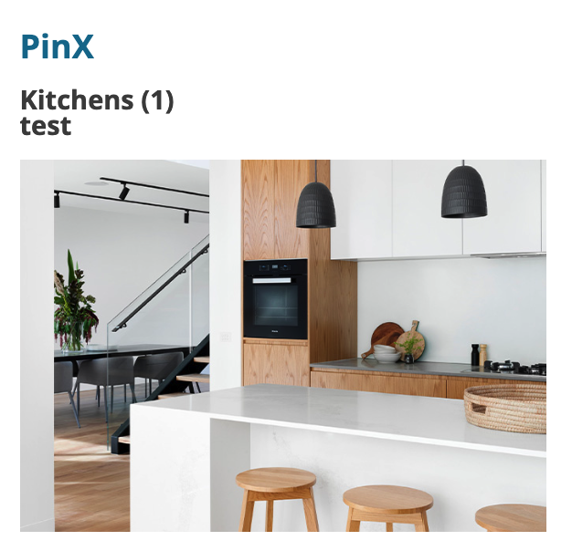
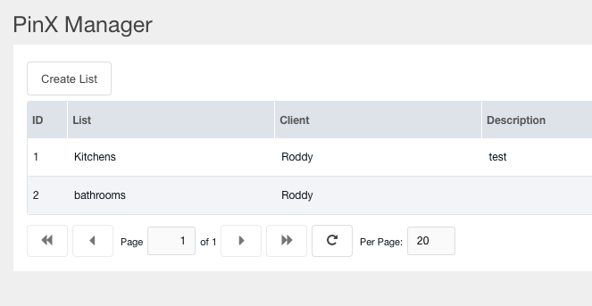

## PinX

Pinterest for users on your MODX Site


[Checkout the YouTube videos](https://youtu.be/cgI2H0dGXtM)

---

## Templates

The templates are divided into two parts, the list heading and the images.

### pinx-set-tpl
To add headings to each lists, you will want to define this template. The *variables* available in this template are:

- [[+id]]
- [[+count]]
- [[+name]]
- [[+description]]

The default template for this looks like this.

    <h2>
        [[+name]] ([[+count]])
        <div>[[+description]]</div>
    </h2>

### pinx-item-tpl
The image template includes these *variables*

- [[+id]]
- [[+title]]
- [[+image]]
- [[+rank]]
- [[+set]]

The default template for this section looks like this

```
<div class="col-md-6 col-lg-4">

</div>
```

    

---

## Snippet call

To output your Users Sets, just place following snippet call in desired location:

**You will need to pair this with the Login Extra**

    [[PinX]]

*Calling it like this will output all sets and their images.*

A more specific call would be like this:

    [[PinX? &listid=`1`]]

## Options

There are more options available to modify the call to your needs:

---

**listid**                 ID-value of list to display (if this is not specified ALL images will be displayed)

**tpl**                 Name of the chunk to display your images

**setTpl**              Name of the chunk to display your images by List

**sortBy**              This allows you to choose which field to sort by (default is rank).

**sortDir**             ASC / DESC

**setOutputSeparator**  Separate each set with the given string.

---

A more complex call would look like this:

    [[PinX?
      &listid=`1`
      &tpl=`pinx-img-tpl`
      &sortBy=`rank`
      &sortDir=`ASC`
      &limit=`10`
      &outputSeparator=`<hr>`
    ]]

---

    

